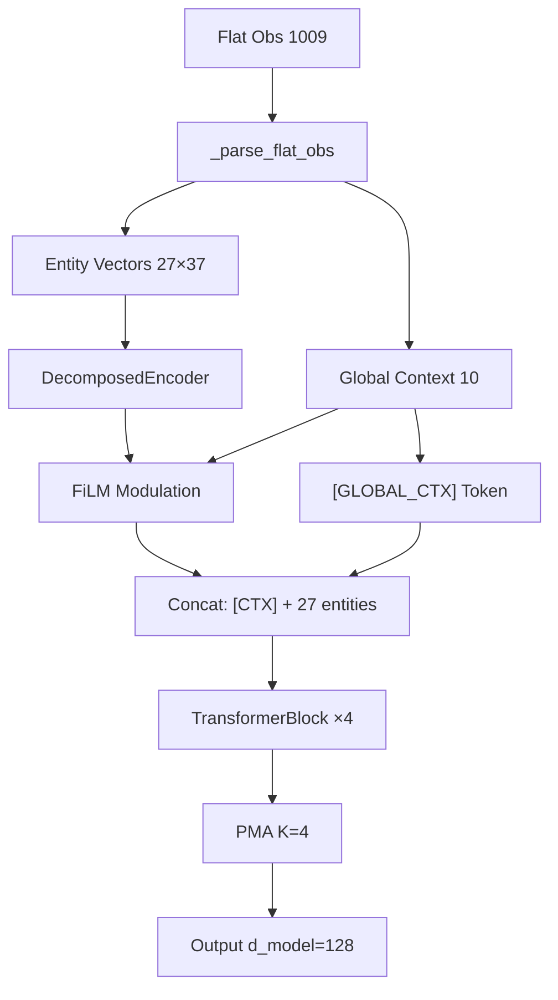

# Hearthstone Autobattler: Сравнительный анализ MLP и Transformer архитектур для RL-агента

## 1. Введение и Цель работы

Целью работы является разработка и сравнительный анализ двух архитектур нейронных сетей для обучения с подкреплением (RL) агента в среде Hearthstone Battlegrounds — автобаттлера с неполной информацией, стохастическими механиками и гетерогенным пространством сущностей.

**Исследовательский вопрос:** Даёт ли Transformer-архитектура с механизмом внимания (attention) преимущество над классическим MLP-baseline в задаче управления стратегией покупки/расстановки юнитов в автобаттлере?

---

## 2. Игровая среда (HearthstoneEnv)

### 2.1 Описание среды

Среда реализует упрощённую версию Hearthstone Battlegrounds "Боёв на поле":

- **Фаза покупки** (Recruit Phase): игрок покупает юнитов из магазина, выставляет их на доску, продаёт ненужных, разыгрывает заклинания
- **Фаза боя** (Combat Phase): автоматическое сражение юнитов двух игроков
- **Экономика**: золото, тир таверны (повышение для доступа к сильным юнитам), замораживание магазина

### 2.2 Пространство наблюдений

```
Observation Space: Box(1009,) — плоский вектор
```

**Раскладка:**

| Компонент | Размер | Описание |
|-----------|--------|----------|
| Global context | 7 | HP героя, золото, тир таверны, скидка на заклинания, кол-во заклинаний, спелл-дисконт, фаза |
| Board (доска) | 7 × 37 = 259 | До 7 юнитов на доске (каждый — 37 признаков) |
| Hand (рука) | 10 × 37 = 370 | До 10 карт в руке |
| Store (магазин) | 7 × 37 = 259 | До 7 юнитов в магазине |
| Discover (выбор) | 3 × 37 = 111 | 3 варианта discover |
| Enemy info | 3 | HP оппонента, тир, кол-во юнитов |

**Вектор сущности (37 признаков):**

| Индексы | Признаки | Тип |
|---------|----------|-----|
| [0] | is_present | Binary |
| [1] | is_spell | Binary |
| [2] | card_id_norm | Continuous |
| [3] | cost | Continuous |
| [4] | tier | Continuous |
| [5] | is_frozen | Binary |
| [6] | ATK | Continuous |
| [7] | HP | Continuous |
| [8..24] | 17 keyword/effect flags | Binary |
| [25] | is_selected | Binary |
| [26..36] | 11 type one-hots (Beast, Mech, Demon...) | Categorical |

### 2.3 Пространство действий

```
Action Space: Discrete(32) с Action Masking
```

| Действие | ID | Описание |
|----------|-----|----------|
| End Turn | 0 | Завершить ход |
| Roll | 1 | Обновить магазин |
| Buy / Discover / Target Board | 2-8 | Купить юнита / выбрать discover / целить по доске |
| Sell / Target Store | 9-15 | Продать юнита / целить по магазину |
| Play Hand | 16-25 | Сыграть карту из руки |
| Swap Right | 26-31 | Переставить юнита (позиционирование) |

### 2.4 Reward Shaping

Функция награды включает:
- Разницу HP между героями после боя
- Бонус за силу доски (board power)
- Штраф за смерть героя
- Экономические бонусы (эффективное использование золота)

---

## 3. Архитектура моделей

### 3.1 MLP Baseline

Классическая архитектура Multilayer Perceptron:

```
Input(1009) → Linear(512) → Tanh → Linear(512) → Tanh → Output
```

| Параметр | Значение |
|----------|----------|
| Архитектура | `[512, 512]` |
| Активация | `Tanh` |
| Общее кол-во параметров | **1,576,481** |
| Алгоритм | MaskablePPO |

### 3.2 Transformer (TransformerFeaturesExtractor)

Модульная архитектура, вдохновлённая Set Transformer, GTrXL, DreamerV3, FiLM, AlphaStar:



#### 3.2.1 DecomposedEncoder

Гетерогенный энкодер сущностей с раздельной обработкой разнотипных признаков:

```
Continuous (5): card_id, cost, tier, ATK, HP → Linear → d_model
Binary (20):    is_present, is_spell, 17 flags → Linear → d_model
Types (11):     one-hot расовых типов          → Linear → d_model
                                        Sum + Zone Embedding
```

Раздельная обработка вместо наивного `Linear(37, d_model)` позволяет сети учить разные масштабы и зависимости для каждого типа признаков.

#### 3.2.2 FiLM (Feature-wise Linear Modulation)

Динамическая модуляция entity-токенов глобальным контекстом (золото, HP, тир таверны):

```
X' = X * (γ + 1) + β, где [γ, β] = MLP(context)
```

- **Zero-Init**: Инициализация весов последнего слоя нулями → FiLM стартует как identity (X' = X)
- **Мотивация**: Позволяет "выключать" интерес к дорогим картам при нулевом золоте, масштабировать ценность юнитов в зависимости от фазы игры

#### 3.2.3 [GLOBAL_CTX] Token

Обучаемый токен глобального контекста (аналог [CLS] из BERT / scalar features из AlphaStar):

```python
global_token = MLP(context)  # [B, 1, D]
x = cat([global_token, entity_tokens], dim=1)  # [B, N+1, D]
```

Позволяет entity-токенам обращаться к глобальному состоянию через Self-Attention.

#### 3.2.4 TransformerBlock с GTrXL-шлюзом

Pre-LN Transformer Block с GRU-подобным Gated Residual Connection:

```
Стандартный:  x' = x + Attention(LN(x))
GTrXL:        x' = GatedResidual(x, Attention(LN(x)))
```

**GatedResidual** (из GTrXL):
```
z = σ(W_z·[x, y] + b_z)     # gate (b_z init = -3 → z ≈ 0.05)
r = σ(W_r·[x, y] + b_r)     # reset
h = tanh(W_h·[r⊙x, y])      # candidate
out = (1-z)⊙x + z⊙h
```

**Identity Init**: `b_z = -3` → на старте тренировки шлюз почти закрыт (z ≈ 0.05), трансформер фактически выключен. Агент сначала учит базовую стратегию через линейные слои, затем постепенно "открывает" attention.

#### 3.2.5 Компоненты FFN и Normalization

| Компонент | Реализация | Мотивация |
|-----------|------------|-----------|
| FFN | SwiGLU (LLaMA) | Gated activation, эффективнее ReLU |
| Normalization | RMSNorm | Быстрее LayerNorm, сопоставимое качество |
| Symlog | DreamerV3 | Безопасное сжатие выбросов (50000 → ~10.8) |

#### 3.2.6 PMA (Pooling by Multihead Attention)

Multi-Seed агрегация (Set Transformer) вместо наивного mean pooling:

```python
seeds = nn.Parameter(randn(1, K=4, d_model))  # 4 обучаемых seed-вектора
out = MultiHeadAttention(Q=seeds, K=entities, V=entities)
result = Linear(K * d_model → d_model)
```

Каждый seed извлекает отдельный аспект оценки доски: сила, экономика, гибкость, синергии.

#### 3.2.7 Итоговая таблица гиперпараметров Transformer

| Параметр | Значение |
|----------|----------|
| d_model | 128 |
| n_heads | 4 |
| n_layers | 4 |
| FFN | SwiGLU (hidden = aligned to 256) |
| Normalization | RMSNorm |
| Gating | GTrXL GatedResidual (bias_init = -3) |
| Pooling | PMA (K = 4 seeds) |
| FiLM d_context | 10 (7 global + 3 enemy) |
| Symlog | Enabled |
| **Общее кол-во параметров** | **~6.5M** (extractor) |

---

## 4. Обучение

### 4.1 Общие настройки

| Параметр | Значение |
|----------|----------|
| Алгоритм | MaskablePPO (sb3-contrib) |
| learning_rate | 3e-4 |
| gamma | 0.99 |
| batch_size | 256 |
| n_steps | 2048 |
| ent_coef | 0.01 |
| n_envs | 4 (SubprocVecEnv) |
| total_timesteps | 1,500,000 |
| seed | 42 |

### 4.2 Инфраструктура

- **GPU**: NVIDIA Tesla T4 (Kaggle)
- **Логирование**: Weights & Biases (project: `hs_autobattler_comparison`)
- **Self-Play**: обновление оппонента каждые 50,000 шагов
- **Чекпоинты**: каждые 100,000 шагов

### 4.3 Zero-Init (DreamerV3)

Для Transformer-модели применяется Zero-Init для action_net и value_net:

```python
nn.init.zeros_(model.policy.action_net.weight)
nn.init.zeros_(model.policy.value_net.weight)
```

Это стабилизирует начало обучения: агент стартует с равномерной политикой, избегая деструктивных градиентов от случайных начальных весов.

---

## 5. Результаты экспериментов

### 5.1 Кривые обучения (WandB)

#### 5.1.1 Средняя сила доски (avg_board_power)

Ключевой экспериментальный результат — **скорость сходимости**:

| Метрика | MLP | Transformer |
|---------|-----|-------------|
| Шаги до плато (~15 board power) | ~400,000 | **~80,000** |
| **Ускорение** | 1x | **~5x** |

**Transformer сходится в ~5 раз быстрее по количеству шагов обучения.**

При этом каждый шаг Transformer-а дороже вычислительно (~3x медленнее per iteration из-за attention), но суммарно Net Sample Efficiency остаётся в пользу Transformer.

#### 5.1.2 Метрики обучения на плато (MLP, 1.5M steps)

| Метрика | Значение | Интерпретация |
|---------|----------|---------------|
| explained_variance | 0.864 | Value function отлично предсказывает return |
| value_loss | 0.14 | Минимальная ошибка критика |
| policy_gradient_loss | -0.016 | Стабильная оптимизация политики |
| entropy_loss | -0.668 | Политика уверена в решениях |
| avg_board_power | ~15 | Потолок среды |

#### 5.1.3 Ссылка на WandB

- **Project URL**: https://wandb.ai/tmitmi-hse/hs_autobattler_comparison
- **MLP run**: `mlp_baseline` (1,500,000 шагов, полный)
- **Transformer run**: `transformer` (300,000 шагов, partial)

### 5.2 PvP Evaluation

Прямое столкновение двух обученных агентов (MLP 1.5M steps vs Transformer 300K steps):

| Game | Transformer HP | MLP HP | ΔHP |
|------|---------------|--------|-----|
| 1 | 22 | 21 | +1 |
| 2 | 30 | 25 | +5 |
| 3 | 24 | 27 | -3 |

**Наблюдение**: Все игры завершились timeout (>500 ходов). Оба агента достигли стабильного равновесия, при котором ни один не может победить другого. HP обоих агентов остаётся на уровне 20-30.

**Интерпретация**: Среда слишком проста для текущих архитектур — оба агента "решили" задачу и выработали survival strategy. Для выявления значимых различий в PvP необходимо усложнение среды.

### 5.3 Визуализация Attention

Attention heatmaps позволяют проверить, выучил ли Transformer осмысленные паттерны взаимодействия между сущностями.

#### 5.3.1 Средний Attention по слоям


**Анализ по слоям:**

| Слой | Паттерн | Интерпретация |
|------|---------|---------------|
| Layer 0 | Фокус на [CTX] и Store (S0-S3) | Оценка доступных покупок в контексте экономики |
| Layer 1 | Cross-attention Store ↔ Hand | Сравнение карт в магазине с картами в руке |
| Layer 2 | Распределённый attention | Интеграция информации из всех зон |
| Layer 3 | Сильный фокус на Store | Финальное решение о покупке |

#### 5.3.2 Индивидуальные Attention Heads (Layer 0)


**Специализация голов:**

| Head | Паттерн | Предположительная функция |
|------|---------|--------------------------|
| Head 0 | Board ↔ Store cross-attention | Сравнение доски с магазином — "что усилит доску?" |
| Head 1 | Store self-attention (S0-S3) | Оценка юнитов в магазине относительно друг друга |
| Head 2 | Context-focused | Глобальный контекст (золото, HP, тир таверны) |
| Head 3 | Store → Context | Соотнесение стоимости покупок с экономикой |

**Вывод**: Transformer выучил семантически осмысленные паттерны внимания, а не просто проксирует MLP. Головы специализируются на разных аспектах оценки (экономика, синергии, позиционирование), что подтверждает гипотезу о пользе attention для стратегических игр.

---

## 6. Структура проекта

```
hs_autobattler/
├── src/hearthstone/
│   ├── engine/          # Игровой движок (combat, tavern, spells, entities, etc.)
│   ├── env/
│   │   └── hs_env.py    # Gymnasium-совместимая среда (obs/action/reward)
│   └── agent/           # Интерфейсы агентов
├── scripts/
│   ├── trans.py          # TransformerFeaturesExtractor (архитектура)
│   ├── train.py          # Локальное обучение MLP
│   ├── train_transformer.py  # Локальное обучение Transformer
│   ├── callbacks.py      # SB3 callbacks (BoardPower, SelfPlay, GameLogger)
│   ├── evaluate_pvp.py   # PvP evaluation
│   ├── visualize_attention.py  # Attention heatmaps
│   ├── kaggle_submit.py  # Self-contained Kaggle kernel builder
│   └── outputs/          # Сохранённые модели и визуализации
├── theory/
│   └── todo.md           # Roadmap дальнейших улучшений
└── pyproject.toml
```

### Ключевые файлы

| Файл | Строк | Описание |
|------|-------|----------|
| [trans.py](file:///c:/Users/Timur/PycharmProjects/hs_autobattler/scripts/trans.py) | 435 | Полная архитектура Transformer (DecomposedEncoder, FiLM, GTrXL, PMA) |
| [hs_env.py](file:///c:/Users/Timur/PycharmProjects/hs_autobattler/src/hearthstone/env/hs_env.py) | 839 | Gymnasium environment (obs space, action masking, reward) |
| [callbacks.py](file:///c:/Users/Timur/PycharmProjects/hs_autobattler/scripts/callbacks.py) | ~200 | BoardPowerCallback, SelfPlayCallback, GameLoggerCallback |
| [kaggle_submit.py](file:///c:/Users/Timur/PycharmProjects/hs_autobattler/scripts/kaggle_submit.py) | ~400 | Self-contained kernel с embedded base64 project |

---

## 7. Выводы

### 7.1 Основные результаты

1. **Sample Efficiency**: Transformer-агент достигает эквивалентного уровня качества игры (avg_board_power ~15) в **~5 раз меньше шагов обучения** по сравнению с MLP-baseline (80K vs 400K шагов)

2. **Вычислительная стоимость**: Transformer-итерация ~3x дороже (68 fps vs 650 fps) из-за O(N²) attention, но суммарный Net Sample Efficiency положителен

3. **Attention Interpretability**: Transformer выучивает семантически осмысленные паттерны внимания:
   - Специализация голов на разных аспектах (экономика, синергии, сравнение зон)
   - Динамический фокус на Store в поздних слоях (ключевая зона для решений о покупке)

4. **Потолок среды**: Обе архитектуры достигают одного и того же плато (board power ~15), что свидетельствует о недостаточной сложности текущей среды для раскрытия полного потенциала Transformer

### 7.2 Ограничения

- Среда упрощена (ограниченный набор юнитов, нет сложных синергий)
- PvP неинформативен из-за потолка среды (timeout всех матчей)
- Transformer обучался только до 300K шагов (vs 1.5M для MLP) из-за ограничений Kaggle GPU

### 7.3 Реализованные архитектурные решения

Следующие техники из исследовательского обзора были **уже реализованы** в текущей версии проекта:

| Техника | Источник | Статус |
|---------|----------|--------|
| Pre-LN (нормализация внутри Residual) | [[22]](https://arxiv.org/abs/2002.04745) | ✅ `TransformerBlock` |
| Symlog-трансформация статов | DreamerV3 [[35]](https://arxiv.org/abs/2301.04104) | ✅ `symlog()` до энкодера |
| DecomposedEncoder (continuous/binary/categorical) | Собственная разработка | ✅ `trans.py` |
| FiLM с Zero-Init | [[5]](https://arxiv.org/abs/1709.07871) | ✅ Pre-Attention модуляция |
| [GLOBAL_CTX] Token | [[AlphaStar]](https://www.nature.com/articles/s41586-019-1724-z), [[36]](https://arxiv.org/abs/2504.04395) | ✅ in-Attention консультация |
| GTrXL Gated Residual (b_z = -3) | [[32]](https://arxiv.org/abs/1910.06764) | ✅ Оба sub-layers |
| PMA (K=4 seeds) | [[31]](https://arxiv.org/abs/1810.00825) | ✅ Multi-seed агрегация |
| SAB вместо ISAB | [[31]](https://arxiv.org/abs/1810.00825) | ✅ O(N²) для ≤28 токенов |
| SwiGLU FFN | [[6]](https://arxiv.org/abs/2002.05202) | ✅ Gated activation |
| RMSNorm | [[7]](https://arxiv.org/abs/1910.07467) | ✅ Быстрее LayerNorm |
| Zero-Init Critic/Actor | [[35]](https://arxiv.org/abs/2301.04104) | ✅ `nn.init.zeros_()` |
| Zone Embedding | [[20]](https://anonymous.4open.science/r/marl-gpt-20365) | ✅ `emb_team` |
| Action Masking | [[10]](https://homepages.dcc.ufmg.br/~ronaldo.vieira/assets/pdf/sbgames-2022.pdf) | ✅ MaskablePPO |
| Padding Mask для пустых слотов | Стандартная практика | ✅ `team_id != 0` |
| Self-Play | Стандартная практика | ✅ `SelfPlayCallback` |

### 7.4 Future Work

#### 7.4.1 Усложнение среды

- **Ауры и триггеры**: позиционные баффы (Вожак стаи: +2/+2 соседним Beast-ам)
- **Расовые синергии**: кросс-расовые бонусы → экспоненциальный рост комбинаторики
- **Заклинания с таргетированием**: расширение action space
- **Экспоненциальный рост статов**: лейтгейм 50 000+ ATK/HP (покрыт symlog)

#### 7.4.2 Энкодер и представление состояний

- **Гибридный EAV + Relative Positional Encoding** [[28]](https://arxiv.org/abs/2501.03832), [[20]](https://anonymous.4open.science/r/marl-gpt-20365): 1) сырые атрибуты → плотный EAV-токен, 2) глобальный Set Transformer, 3) RPE для Клива и позиционных баффов
- **Абстракция состояний** [[1]](https://www.researchgate.net/publication/357898736): one-hot «Тип механики» (Хрип на баф, Хрип на токен) → PPO не переобучается на card_id
- **Кодирование CCG Reference** [[10]](https://homepages.dcc.ufmg.br/~ronaldo.vieira/assets/pdf/sbgames-2022.pdf): векторная репрезентация атрибутов карт
- **Summary Tokens** [[36]](https://arxiv.org/abs/2504.04395): [CLS]-подобные токены для каждой зоны

#### 7.4.3 Action Space и Actor

- **Авторегрессионный Actor (SAINT)** [[37]](https://arxiv.org/abs/2505.12109): $\pi(a|s) = \prod_{i=1}^{k} \pi_i(a_i | s, a_{<i})$, сжатие с $O(\prod |A_i|)$ до $O(\sum |A_i|)$
  - Шаг 1: тип действия → Шаг 2: источник (Pointer Network) → Шаг 3: цель
- **Pointer Network** [[Pointer]](https://arxiv.org/abs/1506.03134), [[AlphaStar]](https://www.nature.com/articles/s41586-019-1724-z): $\text{logits}_i = q \cdot k_i / \sqrt{d}$
- **FiLM-кондиционирование sub-actions** [[37]](https://arxiv.org/abs/2505.12109): $(γ, β)$ от глобального стейта
- **Learnable Sub-Action Embeddings**: `Embed ∈ R^{A×d}` вместо one-hot
- **Динамическое маскирование**: маска шага 2 зависит от шага 1; `logits[~mask] = -inf`

#### 7.4.4 Reward Shaping и Value Function

- **Decomposed Reward** [[36]](https://arxiv.org/abs/2504.04395): $r = r_{economy} + r_{synergy} + r_{combat} + r_{win}$ с затуханием
- **Latent Battle Predictor (Value Equivalence)** [[26]](https://arxiv.org/abs/2209.00588), [[33]](https://arxiv.org/abs/1911.08265): $O(1)$ предсказание winrate; MuZero h/g/f
- **Two-Hot Categorical Critic** [[35]](https://arxiv.org/abs/2301.04104), [[36]](https://arxiv.org/abs/2504.04395): 255 бинов в symlog, cross-entropy, мультимодальность
- **Reward Relabeling (D2T2)** [[27]](https://cpsl.pratt.duke.edu/files/docs/d2t2.pdf), [[7_aaai]](https://ojs.aaai.org/index.php/AAAI/article/view/29499/30825): замена Return-to-Go на $\hat{V}(s)$ (Counterfactual Values)

#### 7.4.5 Планирование и MCTS

- **Breadth-First RMCTS** [[3]](https://arxiv.org/abs/2601.01301): GPU-батчинг, pre-allocated contiguous memory, правило 2× бюджета, бюджет по Prior Policy $N(s,a) = \pi_0(s,a) \cdot (N(s)-1)$
- **AlphaZero Policy Iteration** [[33]](https://arxiv.org/abs/1911.08265), [[4]](https://joshvarty.github.io/AlphaZero/): PUCT, Dirichlet noise ($\varepsilon = 0.25$, $\alpha = 0.03$), MCTS Self-Play тройки $(state, \pi, V)$
- **Open-Loop MCTS** [[29]](https://www.sagarnildas.com), [[16]](https://ai.stackexchange.com/q/9463): фиксированные рандом-сиды; Information Set MCTS с детерминизацией

#### 7.4.6 Память и Opponent Modeling (POMDP)

- **Bayesian Opponent Modeler** [[24]](https://elie.net/blog/hearthstone/predicting-hearthstone-opponent-deck-using-machine-learning): co-occurrence $P(\text{minion}_j | \text{minion}_i)$ → Байесовский классификатор → контр-покупки
- **DTQN (Transformer Decoder)** [[9]](https://arxiv.org/abs/2504.17891): буфер $K$ столов, `<unknown>` аугментация (15-20%), Auxiliary Feature Prediction
- **Bottleneck Memory** [[5_mem]](https://arxiv.org/abs/2505.16950): альтернатива при ограничениях GPU

#### 7.4.7 RL Pipeline

- **Коэволюция бота-учителя** [[23]](https://arxiv.org/abs/2410.19681): 21-весовая $\Delta(a,S,W) = \sum w_i \times \Delta\text{attr}_i$; (μ+λ) ES с self-adapting σ
- **Многоэтапное обучение** [[20]](https://anonymous.4open.science/r/marl-gpt-20365), [[36]](https://arxiv.org/abs/2504.04395):
  1. BC разогрев → 2. PPO Fine-tuning → 3. Self-Play Data → 4. Offline RL v2
  - **Отказ от Decision Transformer** [[34]](https://arxiv.org/abs/2202.05607): Return-to-Go фатален в стохастике
- **Binary Weighted BC** [[36]](https://arxiv.org/abs/2504.04395): $w = 1$ если $Q > \text{median}$, 0 иначе
- **Три бейзлайна** [[10]](https://homepages.dcc.ufmg.br/~ronaldo.vieira/assets/pdf/sbgames-2022.pdf): Random, Greedy, Rule-Based

#### 7.4.8 Стабильность (дополнения)

- **Scale Anchoring** [[14]](https://arxiv.org/abs/2602.10408): $\mathcal{L}_{aux} = ||s(h_t) - s_{tgt}||^2$
- **EMA Target Network** [[35]](https://arxiv.org/abs/2301.04104): $\theta_{tgt} \leftarrow \tau \theta_{tgt} + (1-\tau)\theta$ + Replay Loss
- **Percentile Return Norm** [[35]](https://arxiv.org/abs/2301.04104): $S = \max(\text{P}_{95} - \text{P}_5, 1)$

#### 7.4.9 Документация

- **MDP формализация** [[21]](https://theses.liacs.nl/2366), [[8]](https://lutpub.lut.fi/handle/10024/167789): академические шаблоны State/Action Space
- **Теоретическое обоснование** [[30]](https://arxiv.org/abs/2307.05979): Sample Inefficiency → BC, Non-stationarity → Pre-LN + Gating, DT деградация → Reward Relabeling
- **SOTA-референс Pokémon** [[36]](https://arxiv.org/abs/2504.04395): валидация всего пайплайна

---

## 8. Технические детали

### 8.1 Зависимости

```
stable-baselines3>=2.0
sb3-contrib>=2.0
gymnasium>=0.28
torch>=2.0
wandb>=0.15
numpy>=1.24
matplotlib>=3.7
```

### 8.2 Воспроизведение результатов

```bash
# Обучение MLP (локально)
python scripts/train.py

# Обучение Transformer (локально)
python scripts/train_transformer.py

# Push на Kaggle
python scripts/kaggle_submit.py

# PvP evaluation (после обучения)
python scripts/evaluate_pvp.py --mlp path/to/mlp.zip --transformer path/to/trans.zip

# Attention visualization
python scripts/visualize_attention.py --model path/to/transformer.zip
```

### 8.3 Файлы моделей

| Модель | Файл | Размер | Шаги |
|--------|------|--------|------|
| MLP Final | `mlp_final.zip` | 19 MB | 1,500,000 |
| Transformer | `trans_300000_steps.zip` | 25 MB | 300,000 |
| MLP Checkpoints | `mlp_*_steps.zip` × 15 | 19 MB each | 100K-1.5M |
| Transformer Checkpoints | `trans_*_steps.zip` × 3 | 25 MB each | 100K-300K |

---

## 9. Ссылки

### Архитектура Transformer

| # | Статья | Вклад |
|---|--------|-------|
| [1_attn] | Vaswani et al. (2017) «Attention Is All You Need» [arxiv:1706.03762](https://arxiv.org/abs/1706.03762) | Multi-Head Self-Attention |
| [31] | Lee et al. (2019) «Set Transformer» [arxiv:1810.00825](https://arxiv.org/abs/1810.00825) | PMA, SAB vs ISAB |
| [32] | Parisotto et al. (2020) «GTrXL» [arxiv:1910.06764](https://arxiv.org/abs/1910.06764) | Gated Identity Connections |
| [22] | Xiong et al. (2020) «Pre-LN» [arxiv:2002.04745](https://arxiv.org/abs/2002.04745) | Pre-LN Transformer |
| [6] | Shazeer (2020) «GLU Variants» [arxiv:2002.05202](https://arxiv.org/abs/2002.05202) | SwiGLU activation |
| [7] | Zhang & Sennrich (2019) «RMSNorm» [arxiv:1910.07467](https://arxiv.org/abs/1910.07467) | RMSNorm |
| [28] | (2025) «RPE for entities» [arxiv:2501.03832](https://arxiv.org/abs/2501.03832) | Relative Positional Encoding |

### RL, обучение и стабильность

| # | Статья | Вклад |
|---|--------|-------|
| [35] | Hafner et al. (2023) «DreamerV3» [arxiv:2301.04104](https://arxiv.org/abs/2301.04104) | Symlog, Zero-Init, Percentile Norm, Two-Hot Critic, EMA Target |
| [33] | Silver et al. (2019) «MuZero» [arxiv:1911.08265](https://arxiv.org/abs/1911.08265) | Value Equivalence, Policy Iteration, MCTS Self-Play |
| [30] | Zheng et al. (2023) «Survey: Transformers in RL» [arxiv:2307.05979](https://arxiv.org/abs/2307.05979) | Теоретическое обоснование пайплайна |
| [34] | Zheng et al. (2022) «Online Decision Transformer» [arxiv:2202.05607](https://arxiv.org/abs/2202.05607) | Отказ от DT в стохастике |
| [14] | (2025) «Scale Anchoring» [arxiv:2602.10408](https://arxiv.org/abs/2602.10408) | Anti-logit-chasing |

### Модуляция и Actor

| # | Статья | Вклад |
|---|--------|-------|
| [5] | Perez et al. (2018) «FiLM» [arxiv:1709.07871](https://arxiv.org/abs/1709.07871) | Feature-wise Linear Modulation |
| [37] | (2025) «SAINT» [arxiv:2505.12109](https://arxiv.org/abs/2505.12109) | Факторизация sub-actions, FiLM sub-actions |
| [Pointer] | Vinyals et al. (2015) «Pointer Networks» [arxiv:1506.03134](https://arxiv.org/abs/1506.03134) | Pointer для динамических множеств |

### Стратегические и карточные игры

| # | Статья | Вклад |
|---|--------|-------|
| [AlphaStar] | Vinyals et al. (2019) «AlphaStar» [Nature](https://www.nature.com/articles/s41586-019-1724-z) | [CLS] token, Pointer Network, авторегрессионный Actor |
| [36] | Guo et al. (2025) «Pokémon Agent» [arxiv:2504.04395](https://arxiv.org/abs/2504.04395) | SOTA-референс: EAV, BC, Summary Tokens, Decomposed Rewards |
| [10] | Vieira et al. (2022) «CCG Agent» [UFMG](https://homepages.dcc.ufmg.br/~ronaldo.vieira/assets/pdf/sbgames-2022.pdf) | State Space, Action Masking, PPO baselines |
| [23] | (2024) «Evolutionary HS Agent» [arxiv:2410.19681](https://arxiv.org/abs/2410.19681) | (μ+λ) ES, 21-весовая скоринговая функция |
| [1] | (ResearchGate, 2022) «State Abstraction» [link](https://www.researchgate.net/publication/357898736) | Категории механик для эмбеддингов |

### Планирование и MCTS

| # | Статья | Вклад |
|---|--------|-------|
| [3] | (2025) «RMCTS» [arxiv:2601.01301](https://arxiv.org/abs/2601.01301) | GPU-батчинг, pre-allocated memory, 2× бюджет |
| [4] | Varty «AlphaZero» [blog](https://joshvarty.github.io/AlphaZero/) | PUCT, Dirichlet noise |
| [29] | SagarNilDas «MCTS» [blog](https://www.sagarnildas.com) | Open-Loop MCTS, IS-MCTS |
| [16] | AI StackExchange [link](https://ai.stackexchange.com/q/9463) | Open-Loop MCTS для стохастики |

### Память и Opponent Modeling

| # | Статья | Вклад |
|---|--------|-------|
| [9] | (2025) «DTQN» [arxiv:2504.17891](https://arxiv.org/abs/2504.17891) | Transformer Decoder, `<unk>` аугментация, Auxiliary Prediction |
| [24] | Elie.net «HS Opponent» [blog](https://elie.net/blog/hearthstone/predicting-hearthstone-opponent-deck-using-machine-learning) | Bayesian co-occurrence classifier |
| [20] | MARL-GPT [OpenReview](https://anonymous.4open.science/r/marl-gpt-20365) | EAV, Zone Embedding, Self-Play |
| [5_mem] | (2025) «Bottleneck Memory» [arxiv:2505.16950](https://arxiv.org/abs/2505.16950) | Альтернатива DTQN |

### Offline RL и Reward Shaping

| # | Статья | Вклад |
|---|--------|-------|
| [27] | D2T2 [Duke](https://cpsl.pratt.duke.edu/files/docs/d2t2.pdf) | Reward Relabeling, Counterfactual Values |
| [7_aaai] | (AAAI, 2024) «Counterfactual RL» [link](https://ojs.aaai.org/index.php/AAAI/article/view/29499/30825) | Reward Relabeling для стохастики |
| [26] | (2022) «Latent Predictor» [arxiv:2209.00588](https://arxiv.org/abs/2209.00588) | Value Equivalence, MuZero h/g/f |

### Формализация

| # | Статья | Вклад |
|---|--------|-------|
| [21] | (Leiden Thesis) «HS BG RL» [Leiden](https://theses.liacs.nl/2366) | MDP формализация |
| [8] | (LUT Thesis) «HS Agent» [LUT](https://lutpub.lut.fi/handle/10024/167789) | State/Action Space шаблоны |

### Проигнорированные работы

| # | Статья | Причина |
|---|--------|---------|
| [11-13] | FlashAttention 2/3/4 | Аппаратная оптимизация, актуальна при масштабировании |
| [17-19] | KV-кэш туториалы | Нерелевантно для нерекуррентного Set Transformer |
| [2] | xLSTM [arxiv:2405.04517](https://arxiv.org/abs/2405.04517) | Альтернатива для моделей >100M параметров |
| [15, 25] | Сырые ссылки/треды | Не содержат методологического вклада |

